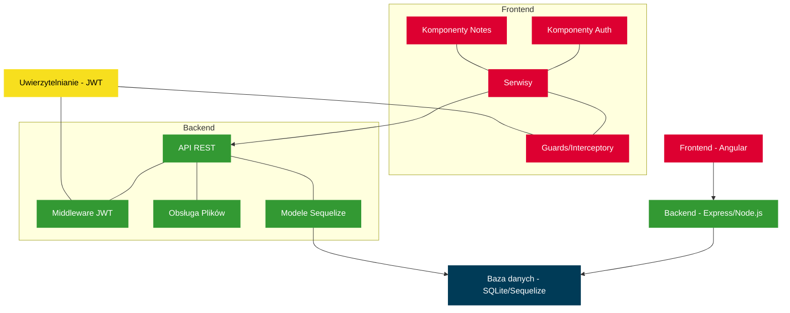

```mermaid

graph TD
A[Frontend - Angular]
B[Backend - Express/Node.js]
C[Baza danych - SQLite/Sequelize]
D[Uwierzytelnianie - JWT]

    subgraph Frontend
        A1[Komponenty Auth]
        A2[Komponenty Notes]
        A3[Serwisy]
        A4[Guards/Interceptory]
    end

    subgraph Backend
        B1[API REST]
        B2[Middleware JWT]
        B3[Obsługa Plików]
        B4[Modele Sequelize]
    end

    A --> B
    B --> C
    A1 --- A3
    A2 --- A3
    A3 --- A4
    A3 --> B1
    B1 --- B2
    B1 --- B3
    B1 --- B4
    B4 --> C
    D --- B2
    D --- A4

    classDef angular fill:#DD0031,stroke:#DD0031,color:white;
    classDef node fill:#339933,stroke:#339933,color:white;
    classDef db fill:#003B57,stroke:#003B57,color:white;
    classDef auth fill:#F7DF1E,stroke:#F7DF1E,color:black;

    class A,A1,A2,A3,A4 angular;
    class B,B1,B2,B3,B4 node;
    class C db;
    class D auth;
```
